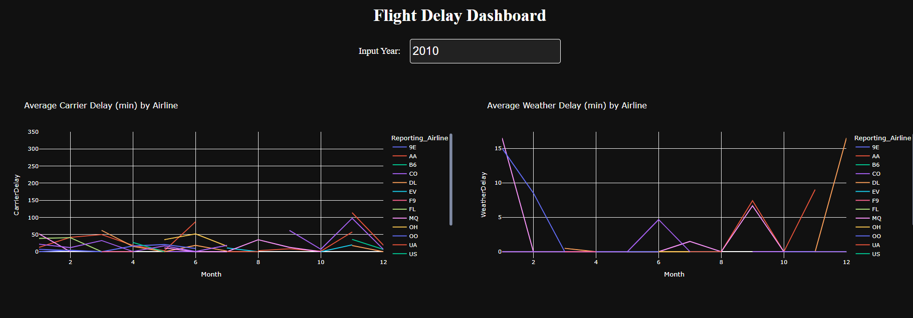
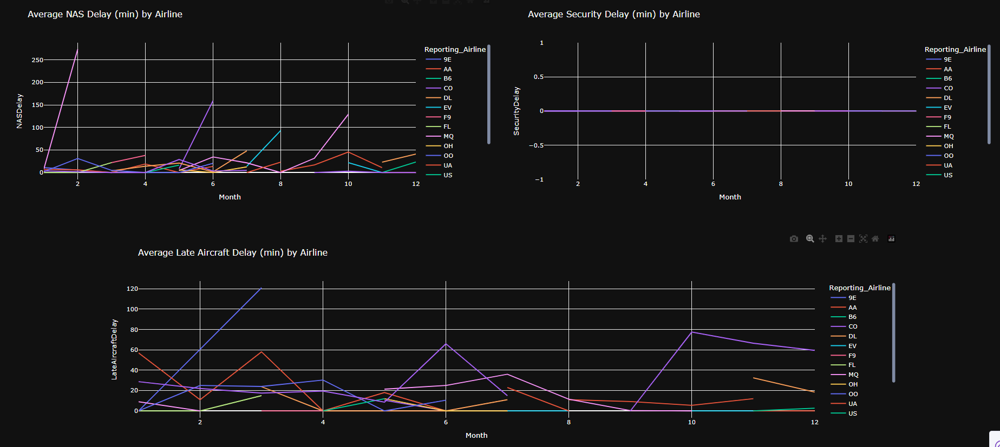

# ✈️ Flight Delay Dashboard

An interactive Dash application built with Plotly to visualize flight delay statistics across U.S. airlines for any selected year.

---

## 🚀 Features

- ✅ Input any year to dynamically update visualizations
- 📉 Line charts for 5 types of delay causes:
  - Carrier Delay
  - Weather Delay
  - NAS Delay
  - Security Delay
  - Late Aircraft Delay
- 🌙 Sleek Dark Theme UI for better visual contrast
- ⚡ Fast and responsive layout using Dash and Plotly
- 📦 Local CSV file used as data source
- 🐍 100% Python – easy to extend, customize, and deploy

---

## 📸 Preview

---

## 📁 Project Structure

<pre> flight-delay-dashboard/ ├── <b>app.py</b> # Main Dash app file ├── <b>airline_data.csv</b> # Local airline dataset (CSV) ├── <b>requirements.txt</b> # Python dependencies ├── <b>README.md</b> # Project documentation └── <b>assets/</b> # Folder for images, CSS, etc. ├── <b>screenshot.png</b> # Preview of dashboard └── <b>screenshot2.png</b> # Optional: second preview </pre>

